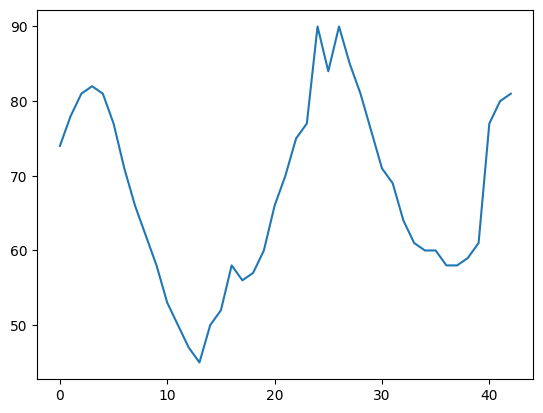
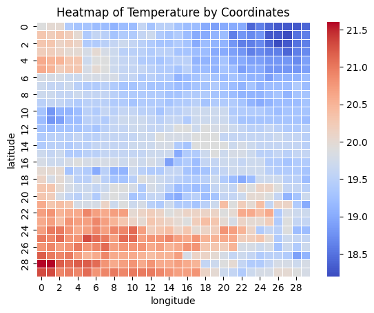

# WeatherBot
## Задача
Предсказать погодные условия по некоторой истории измерений.
### Данные
Было дано 7 файлов npy формата 43 x 30 x 30 - измерения на карте 30х30
за 43 часов наблюдения: temperature, pressure, humidity, wind_speed,
wind_dir, cloud_cover


График зависимости влажности в какой-то точке 



Heatmap температуры по координатам в какой-то момент времени

## Решение
Для решения мы решили использовать библиотеку ETNA (от Тинькофф). 
Данная библиотека была создана специально для решения задач временных рядов,
она включает в себя много подходов и помогает быстрее попробовать много 
гипотез. 
- Первой моделью мы решили использовать CatBoost, так как хорошо с ней
знакомы. Для этого мы сделали датасет и преобразования данных
```python
pipe = Pipeline(
    transforms=[
        TimeFlagsTransform(minute_in_hour_number=False),
        LagTransform(in_column="target", lags=list(range(5, 25, 1)), out_column="lag"),
        MeanTransform(in_column=f"lag_{5}", window=5),
        MeanTransform(in_column=f"lag_{10}", window=5),
        MeanTransform(in_column=f"lag_{15}", window=5),
        MeanTransform(in_column=f"lag_{20}", window=5),
        LogTransform(in_column=f"lag_{5}"),
        LogTransform(in_column=f"lag_{10}"),
        LogTransform(in_column=f"lag_{15}"),
        LogTransform(in_column=f"lag_{20}"),
    ],
    model=CatBoostMultiSegmentModel(),
    horizon=HORIZON
)
```
Данный способ дал public score: MAPE - 0.64253
- Второй моделью мы решили попробовать использовать LSTM, так как 
у нас данные многомерны, а нейронные сети хорошо с ними работают.
В ETNA также есть реализация LSTM
```python
model_deepar = DeepARModel(
    encoder_length=HORIZON,
    decoder_length=HORIZON,
    trainer_params=dict(max_epochs=10, gpus=1, gradient_clip_val=0.1),
    lr=0.01,
    train_batch_size=64,
)
metrics = [SMAPE(), MAPE()]

pipeline_deepar = Pipeline(
   model=model_deepar,
   transforms=[
        TimeFlagsTransform(minute_in_hour_number=False, half_hour_number=True),
        LagTransform(in_column="target", lags=list(range(5, 10, 1)), out_column="lag"),
    ],
   horizon=HORIZON)
``` 
Public score: MAPE - 0.57401

## Телеграм-бот
Для локального запуска бота вам понадобится создаться .env - файл с 
BOT_TOKEN

Тогда можно запустить наше решение в Docker
```docker
docker-compose up -d
```

Также бот доступен в телеграм - https://t.me/WeatherPredictionDubnaHackBot